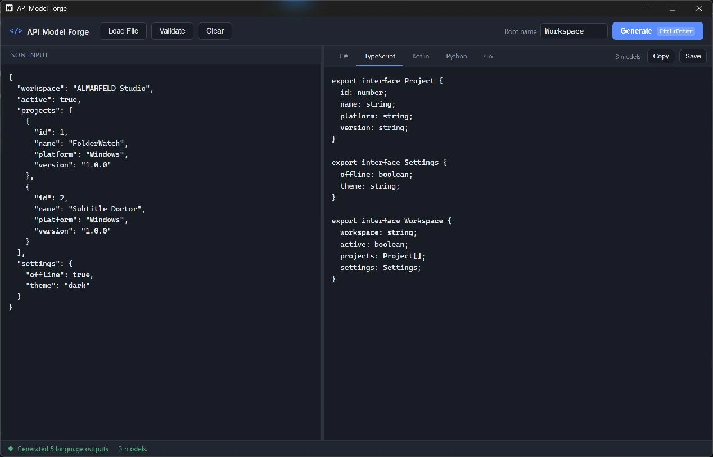

# API Model Forge

API Model Forge is a desktop developer utility that turns a JSON object or
API response into strongly typed models for five programming languages at
once. Paste a response, pick a root name, and get ready-to-use classes,
interfaces, data classes or structs — without writing any mapping code by
hand.

It's a native Windows desktop app (Go + [Wails](https://wails.io)), runs
fully offline, and never sends your JSON anywhere.

## Current release and download

[API Model Forge v1.0.0](https://github.com/AlinTibi/APIModelForge/releases/tag/v1.0.0)
is the current Windows x64 release.

[Download the portable ZIP](https://github.com/AlinTibi/APIModelForge/releases/download/v1.0.0/APIModelForge-v1.0.0-win-x64.zip),
extract it, and run `APIModelForge.exe`. Keep the extracted files together.
Microsoft Edge WebView2 Runtime is required. Install it separately if missing.

## v1.0.1 release candidate

The next patch is prepared for review, not yet released. See the
[v1.0.1 release notes](docs/release-notes-v1.0.1.md) for JSON validation,
identifier safety, escaping and the distinct Windows icon.

Kotlin and Python models record renamed JSON keys in comments; callers must
configure their serializer's name mapping if those keys differ from the
generated property names. Go and C# output preserve serialized names.

## Screenshots



## Supported output languages

| Language   | Output                                                              |
|------------|----------------------------------------------------------------------|
| C#         | Public classes, `List<T>`, nullable reference types, `JsonPropertyName` when needed |
| TypeScript | `interface` declarations, arrays, optional/nullable properties       |
| Kotlin     | `data class`, nullable types, `List<T>`                              |
| Python     | `@dataclass` (keyword-only), `list[...]`, `Optional[...]`            |
| Go         | Structs, exported fields, `json` tags, slices, pointers for nullable fields |

## Features

- Paste JSON directly, or load it from a file
- Validate JSON with a precise line/column error location
- Infers a single shared type tree from your JSON, then renders it for all
  five languages at once — no per-language re-parsing
- Handles nested objects, nested arrays, nullable values, and arrays whose
  elements don't all share the same shape (fields are merged and marked
  optional/nullable as needed)
- Editable root type name, with automatic, collision-safe naming for every
  nested type
- Language tabs, instant regeneration when the root name changes
- Copy to clipboard or save any generated file with a native save dialog
- Dark, modern interface with resizable panes and a `Ctrl+Enter` shortcut

## Requirements

- Windows 10 or Windows 11 (the first supported platform; the codebase is
  kept cross-platform where practical)

## Build from source

Requirements:

- Go 1.25+
- Node.js 22.12+
- The [Wails v2 CLI](https://wails.io/docs/gettingstarted/installation):
  `go install github.com/wailsapp/wails/v2/cmd/wails@v2.16.0`

```powershell
cd frontend
npm ci
npm run build
cd ..

# Run the Go test suite
go test ./...

# Launch in dev mode (hot reload)
wails dev

# Build a production executable (build/bin/APIModelForge.exe)
wails build -clean -s -webview2 browser
```

## Architecture

Generation logic is fully decoupled from the UI:

- `internal/schema` — infers a language-agnostic type tree from JSON
  (nullability, merging, type naming)
- `internal/generator/{csharp,typescript,kotlin,python,golang}` — one
  renderer per language, each consuming the same tree
- `app.go` — thin Wails bindings exposed to the frontend
- `frontend/` — the Wails/Vite + TypeScript UI

## Privacy

API Model Forge is fully offline. It has no telemetry, no analytics, and no
network calls of any kind — your JSON never leaves your machine.

## License

[MIT](LICENSE)

## Support and security

For software questions, email [support@almarfeld.com](mailto:support@almarfeld.com).
Report reproducible bugs and feature requests in [API Model Forge issues](https://github.com/AlinTibi/APIModelForge/issues).
Do not post private files or credentials in public issues.

Report vulnerabilities privately to [security@almarfeld.com](mailto:security@almarfeld.com).
See [SUPPORT.md](SUPPORT.md) and [SECURITY.md](SECURITY.md).

---

**ALMARFELD** · Independent software development · [almarfeld.com](https://almarfeld.com)

[API Model Forge product page](https://almarfeld.com/software/api-model-forge/) ·
[General enquiries](mailto:contact@almarfeld.com) · [MIT license](LICENSE)
